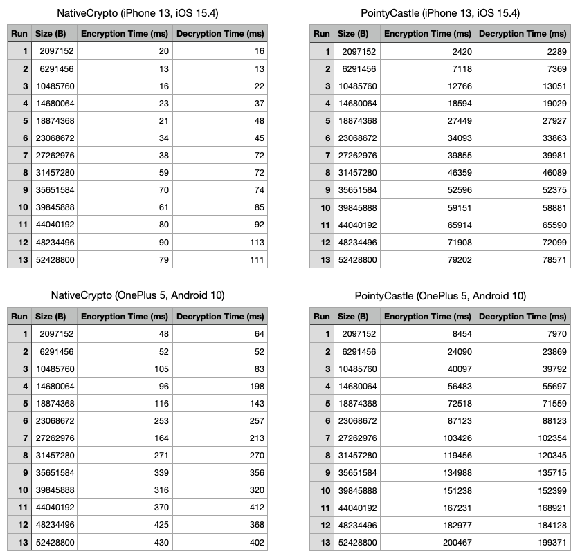

<p align="center">

<h5 align="center">Fast and powerful cryptographic functions for Flutter.</h5>
</p>

<p align="center">
<a href="https://git.wyatt-studio.fr/Wyatt-FOSS/wyatt-packages/src/branch/master/packages/wyatt_analysis">

</a>

<a href="https://github.com/invertase/melos">

</a>

<a href="https://drone.wyatt-studio.fr/hugo/native-crypto">

</a>
</p>

---

[[Changelog]](./CHANGELOG.md) | [[License]](./LICENSE)

---

## About

The goal of this plugin is to provide a fast and powerful cryptographic functions by calling native libraries. On Android, it uses [javax.cypto](https://developer.android.com/reference/javax/crypto/package-summary), and on iOS, it uses [CommonCrypto](https://opensource.apple.com/source/CommonCrypto/) and [CryptoKit](https://developer.apple.com/documentation/cryptokit/)

I started this projet because I wanted to add cryptographic functions on a Flutter app. But I faced a problem with the well-known [Pointy Castle](https://pub.dev/packages/pointycastle) library: the performance was very poor. Here some benchmarks and comparison:



For comparison, on a *iPhone 13*, you can encrypt/decrypt a message of **2MiB** in **~5.6s** with PointyCastle and in **~40ms** with NativeCrypto. And on an *OnePlus 5*, you can encrypt/decrypt a message of **50MiB** in **~6min30** with PointyCastle and in less than **~1s** with NativeCrypto.

In short, NativeCrypto is incomparable with PointyCastle.

## Features

* Hash functions
    - SHA-256
    - SHA-384
    - SHA-512
* HMAC functions
    - HMAC-SHA-256
    - HMAC-SHA-384
    - HMAC-SHA-512
* Secure random
* PBKDF2
* AES
    - Uint8List encryption/decryption
    - File encryption/decryption

## Quick start

```dart
import 'package:native_crypto/native_crypto.dart';

Future<void> main() async {
    // Message to encrypt
    final Uint8List message = 'Hello World!'.toBytes();
    
    // Ask user for a password
    final String password = await getPassword();

    // Initialize a PBKDF2 object
    final Pbkdf2 pbkdf2 = Pbkdf2(
        length: 32, // 32 bytes
        iterations: 1000,
        salt: 'salt'.toBytes(),
        hashAlgorithm: HashAlgorithm.sha256,
    );
    
    // Derive a secret key from the password
    final SecretKey secretKey = await pbkdf2(password: password);

    // Initialize an AES cipher
    final AES cipher = AES(
        key: secretKey,
        mode: AESMode.gcm,
        padding: AESPadding.none,
    );

    // Encrypt the message
    final CipherText<AESCipherChunk> cipherText = await cipher.encrypt(message);

    // Decrypt the message
    final Uint8List decryptedMessage = await cipher.decrypt(cipherText);

    // Verify and print the decrypted message
    assert(listEquals(message, decryptedMessage));
    
    print(decryptedMessage.toStr());
}
```

Check the [example](./native_crypto/example) for a complete example.

Please take a look a the compatibility table below to check if your target is supported.

> Note: This **Flutter** example must run on a real device or a simulator.

## Usage

First, check compatibility with your targets.

| iOS | Android | MacOS | Linux | Windows | Web |
| --- | ------- | ----- | ----- | ------- | --- |
| ✅  | ✅      | ❌     | ❌     | ❌      | ❌  |

> Warning: NativeCrypto 0.2.0+ is not compatible with lower NativeCrypto versions. Especially, with NativeCrypto 0.0. X because the cipher mode is not the same. Now, NativeCrypto uses AES-GCM mode instead of AES-CBC mode. (See [Changelog](./CHANGELOG.md)) 

#### Hash

To digest a message, you'll need to initialize a Hasher object implementing `Hash` . Then, you can digest your message.

```dart
Hash hasher = Sha256();
Uint8List digest = await hasher.digest(message);
```

> In NativeCrypto, you can use the following hash functions: SHA-256, SHA-384, SHA-512

#### HMAC

To generate a HMAC, you'll need to initialize a `Hmac` object. Then, you can generate a HMAC from a message and a secret key.

```dart
Hmac hmac = HmacSha256();
Uint8List hmac = await hmac.digest(message, secretKey);
```

> In NativeCrypto, you can use the following HMAC functions: HMAC-SHA-256, HMAC-SHA-384, HMAC-SHA-512

#### Keys

You can build a `SecretKey` from utf8, utf16, base64, base16 (hex) strings, int list or raw bytes. You can also generate a SecretKey from secure random.

```dart
SecretKey secretKey = SecretKey(bytes); // bytes is a Uint8List
SecretKey secretKey = SecretKey.fromUtf8('secret');
SecretKet secretKey = SecretKey.fromUtf16('secret');
SecretKey secretKey = SecretKey.fromBase64('c2VjcmV0');
SecretKey secretKey = SecretKey.fromBase16('63657274');
SecretKey secretKey = SecretKey.fromList([0x73, 0x65, 0x63, 0x72, 0x65, 0x74]);
SecretKey secretKey = await SecretKey.fromSecureRandom(32); // 32 bytes
```

#### Key derivation

You can derive a `SecretKey` using **PBKDF2**.

First, you need to initialize a `Pbkdf2` object.

```dart
final Pbkdf2 pbkdf2 = Pbkdf2(
    length: 32, // 32 bytes
    iterations: 1000,
    salt: salt.toBytes(),
    hashAlgorithm: HashAlgorithm.sha256,
);
```

Then, you can derive a `SecretKey` from a password.

```dart
SecretKey secretKey = await pbkdf2(password: password); 
```

> Note: Pbkdf2 is a callable class. You can use it like a function.

#### Cipher

And now, you can use the `SecretKey` to encrypt/decrypt a message.

First, you need to initialize a `Cipher` object.

```dart
final AES cipher = AES(
    key: key,
    mode: AESMode.gcm,
    padding: AESPadding.none,
);
```

Then, you can encrypt your message.

```dart
final CipherText<AESCipherChunk> cipherText = await cipher.encrypt(message); 
```

After an encryption you obtain a `CipherText` which contains chunks. You can get the underlying bytes with `cipherText.bytes` .

Uppon receiving encrypted message `receivedData` , you can decrypt it.
You have to reconstruct the ciphertext and the setup the chunk factory.

```dart
final CipherText<AESCipherChunk> receivedCipherText CipherText(
    receivedData,
    chunkFactory: (bytes) => AESCipherChunk(
        bytes,
        ivLength: cipher.mode.ivLength,
        tagLength: cipher.mode.tagLength,
    ),
),
```

Then, you can decrypt your message.

```dart
Uint8List message = await cipher.decrypt(receivedCipherText);
```

#### Files

You can encrypt/decrypt files.

First, you need to initialize a `Cipher` object.

```dart
final AES cipher = AES(
    key: key,
    mode: AESMode.gcm,
    padding: AESPadding.none,
);
```

Then, you can encrypt your file.

```dart
await cipher.encryptFile(plainText, cipherText);
```

> Note: `plainText` and `cipherText` are `File` objects.

You can decrypt your file.

```dart
await cipher.decryptFile(cipherText, plainText);
```

#### Advanced

You can force the use of a specific IV. Please note that the IV must be unique for each encryption.

```dart
final CipherText<AESCipherChunk> cipherText = await cipher.encryptWithIV(message, iv);
```

⚠️ Use `encrypt(...)` instead of `encryptWithIV(...)` if you don't know what you are doing.

## Development

### Android

> https://docs.flutter.dev/development/packages-and-plugins/developing-packages#step-2b-add-android-platform-code-ktjava

* Launch Android Studio.
* Select Open an existing Android Studio Project in the Welcome to Android Studio dialog, or select File > Open from the menu, and select the `packages/native_crypto/example/android/build.gradle` file.
* In the Gradle Sync dialog, select OK.
* In the Android Gradle Plugin Update dialog, select Don’t remind me again for this project.

### iOS

> https://docs.flutter.dev/development/packages-and-plugins/developing-packages#step-2c-add-ios-platform-code-swifthm

* Launch Xcode.
* Select File > Open, and select the `packages/native_crypto/example/ios/Runner.xcworkspace` file.
